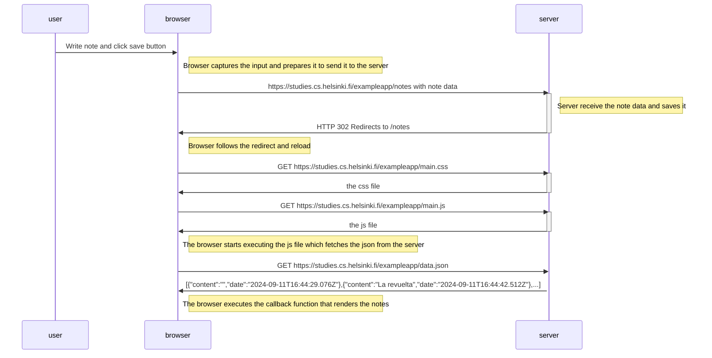

```mermaid

sequenceDiagram
    participant user
    participant browser
    participant server

    user ->> browser: Write note and click save button
    Note right of browser : Browser captures the input and prepares it to send it to the server

    browser ->> server : https://studies.cs.helsinki.fi/exampleapp/notes with note data

    activate server
    Note right of server : Server receive the note data and saves it

    server ->> browser : HTTP 302 Redirects to /notes
    deactivate server

    Note right of browser : Browser follows the redirect and reload

    browser ->> server : GET https://studies.cs.helsinki.fi/exampleapp/main.css
    activate server
    server ->> browser : the css file
    deactivate server

    browser ->> server : GET https://studies.cs.helsinki.fi/exampleapp/main.js
    activate server
    server ->> browser : the js file 
    deactivate server
    Note right of browser : The browser starts executing the js file which fetches the json from the server

    browser ->> server : GET https://studies.cs.helsinki.fi/exampleapp/data.json
    activate server
    server ->> browser : [{"content":"","date":"2024-09-11T16:44:29.076Z"},{"content":"La revuelta","date":"2024-09-11T16:44:42.512Z"},...]

    Note right of browser : The browser executes the callback function that renders the notes


```
