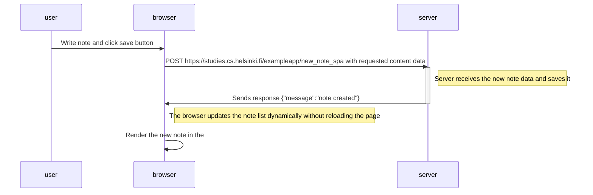

```mermaid

sequenceDiagram
    participant user
    participant browser
    participant server

    user ->> browser : Write note and click save button
    browser ->> server : POST https://studies.cs.helsinki.fi/exampleapp/new_note_spa with requested content data
    activate server
    Note right of server : Server receives the new note data and saves it
    server ->> browser : Sends response {"message":"note created"}
    deactivate server

    Note right of browser : The browser updates the note list dynamically without reloading the page

    browser ->> browser : Render the new note in the
```