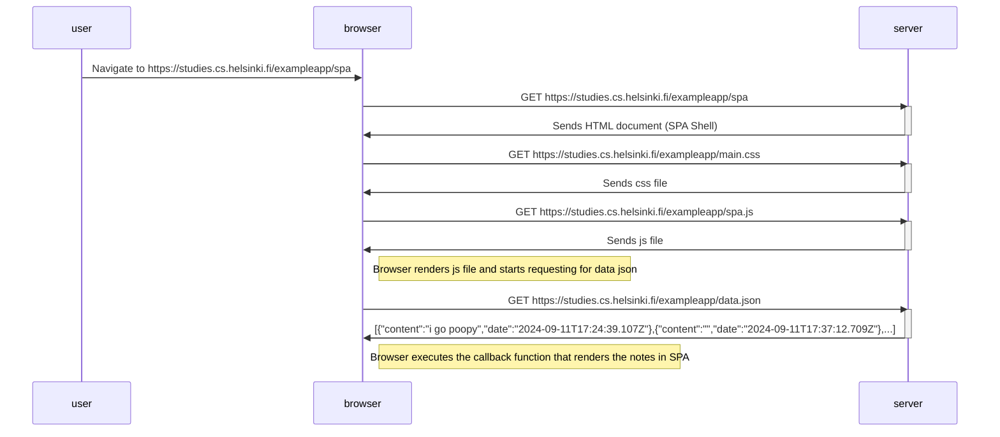

```mermaid

sequenceDiagram
    participant user
    participant browser
    participant server

    user ->> browser : Navigate to https://studies.cs.helsinki.fi/exampleapp/spa
    browser ->> server : GET https://studies.cs.helsinki.fi/exampleapp/spa
    activate server
    server ->> browser : Sends HTML document (SPA Shell)
    deactivate server

    browser ->> server : GET https://studies.cs.helsinki.fi/exampleapp/main.css
    activate server
    server ->> browser : Sends css file
    deactivate server

    browser ->> server : GET https://studies.cs.helsinki.fi/exampleapp/spa.js
    activate server
    server ->> browser : Sends js file
    deactivate server

    Note right of browser : Browser renders js file and starts requesting for data json

    browser ->> server : GET https://studies.cs.helsinki.fi/exampleapp/data.json
    activate server
    server ->> browser : [{"content":"i go poopy","date":"2024-09-11T17:24:39.107Z"},{"content":"","date":"2024-09-11T17:37:12.709Z"},...]
    deactivate server

    Note right of browser : Browser executes the callback function that renders the notes in SPA

```